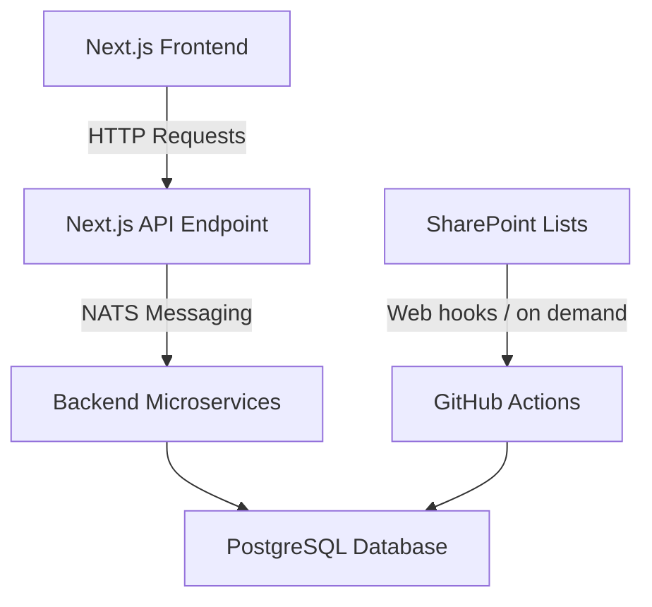
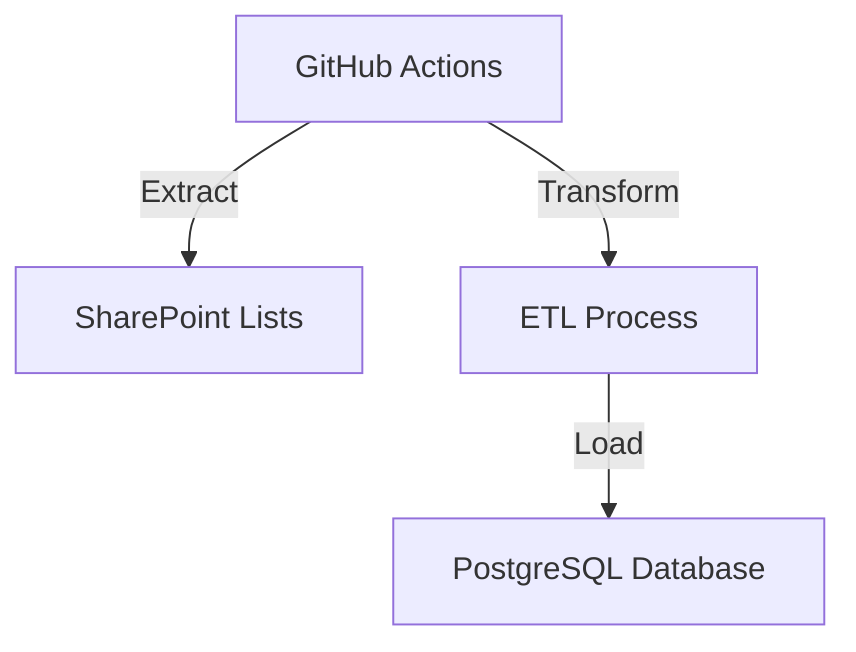
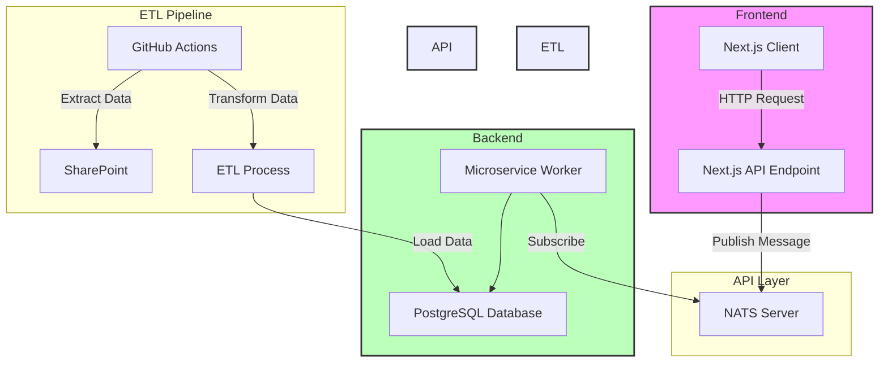
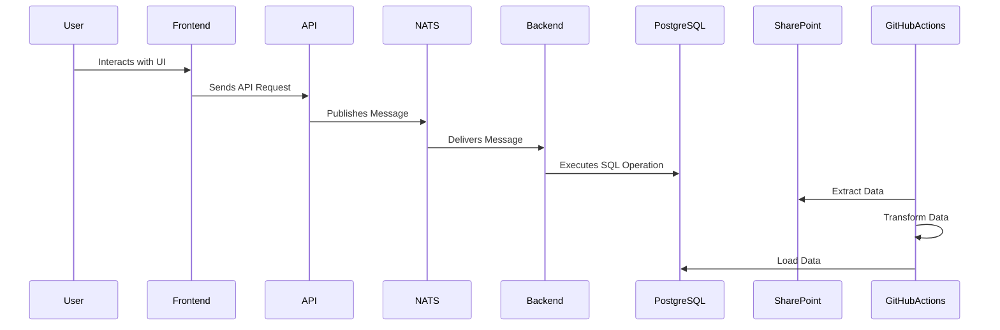

# Tools Application Dataflow Overview

This document outlines the dataflow within the Tools application built with Next.js. It covers the interactions between the frontend, backend, databases, and external services, providing a clear understanding of how data moves through the system.

## Table of Contents

1. [Architecture Overview](#architecture-overview)
2. [Frontend (Next.js)](#frontend-nextjs)
3. [API Layer](#api-layer)
4. [Backend Services](#backend-services)
5. [Data Storage](#data-storage)
6. [Data Pipeline (ETL)](#data-pipeline-etl)
7. [Mermaid Diagrams](#mermaid-diagrams)

---

## Architecture Overview

The Tools application follows a modern microservices architecture, leveraging Next.js for the frontend and a set of backend services communicating via NATS. Data is primarily stored in a PostgreSQL database and SharePoint lists, with GitHub Actions facilitating the ETL (Extract, Transform, Load) processes.

### High-Level Architecture Diagram

---

## Frontend (Next.js)

- **Framework**: Next.js with client-side rendering (`"use client"` directive).
- **Responsibilities**:
  - Provides the user interface.
  - Handles user interactions and client-side logic.
  - Communicates with the backend via a single API endpoint.

## API Layer

- **Single API Endpoint**: Acts as the bridge between the frontend and backend services.
- **Communication Protocol**: Utilizes NATS for message-based communication to ensure scalable and decoupled interactions with backend microservices.

## Backend Services

- **Microservice Worker**:
  - Connects to the PostgreSQL database.
  - Handles various data operations such as SQL `SELECT` statements and CRUD (Create, Read, Update, Delete) operations.
  - Interacts with SharePoint lists for additional data management.
- **Communication**:
  - Receives messages from the API layer via NATS.
  - Processes requests and performs necessary data operations.

## Data Storage

### PostgreSQL Database

- **Purpose**: Stores structured application data.
- **Operations**: Handles SQL queries including `SELECT`, `INSERT`, `UPDATE`, `DELETE`, `PATCH`, and `RESTORE`.

### SharePoint Lists

- **Distribution**: Data is maintained across multiple SharePoint site collections, including Communication Sites and Team Sites.
- **Central Registration**: All SharePoint lists are registered in a central list for easy management and access.

## Data Pipeline (ETL)

- **GitHub Actions**:
  - Designed to perform Extract, Transform, and Load (ETL) operations.
  - **Extract**: Pulls data from SharePoint lists.
  - **Transform**: Processes and formats data as needed.
  - **Load**: Inserts or updates data in the PostgreSQL database.

### ETL Workflow Diagram

---

## Mermaid Diagrams

### 1. Detailed Dataflow Diagram

### 2. Data Operations Flow

